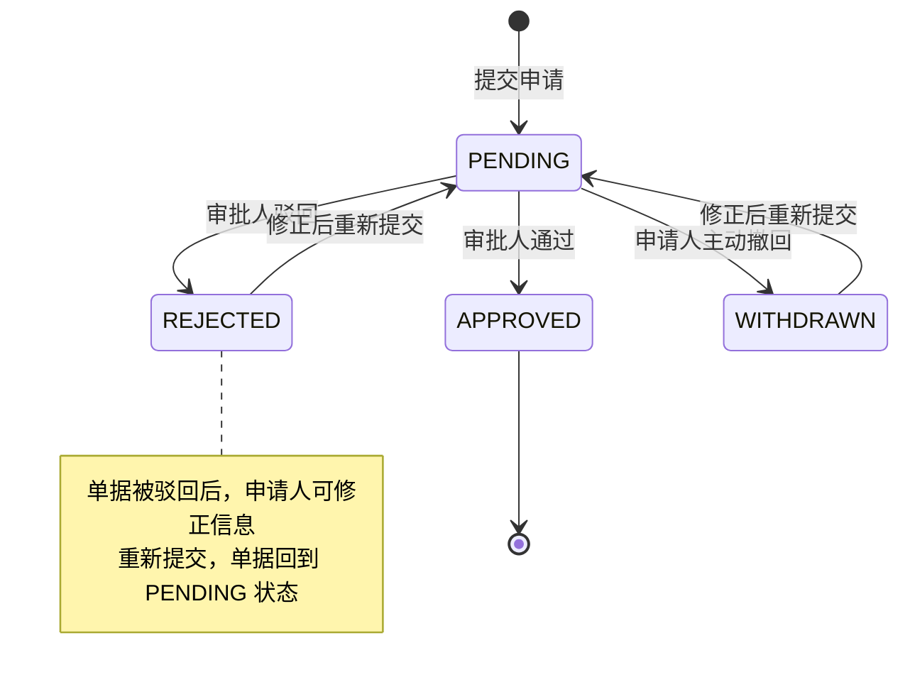
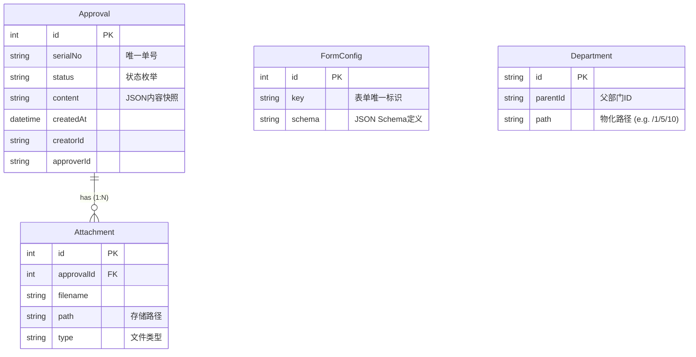
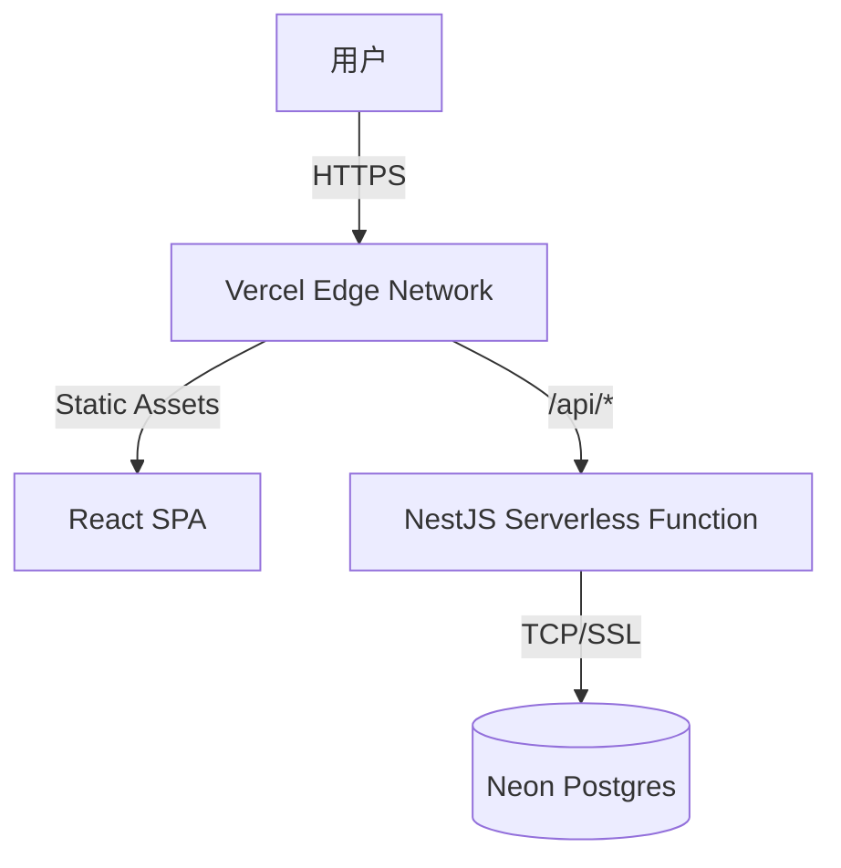

# 企业级审批管理系统 (Approval System)

## 1. 项目概述

**🔴 在线演示地址**: [https://approval-system-frontend-demo.vercel.app/approval](https://approval-system-frontend-demo.vercel.app/approval)

本项目是一个基于 **React (Frontend)** 和 **NestJS (Backend)** 构建的全栈审批管理系统。系统旨在解决企业内部复杂的流程审批需求，实现了从审批单发起、流转、决策到归档的全生命周期管理。

项目核心采用**前后端分离**架构，引入了**动态表单引擎**、**有限状态机 (FSM)** 以及**RBAC 基础权限控制**等技术方案，确保了系统的灵活性、可扩展性与数据一致性。

---

## 2. 技术架构与选型

### 2.1 后端架构 (Backend)

后端服务基于 **NestJS** 框架构建，遵循模块化设计原则。

*   **Runtime**: Node.js
*   **Framework**: NestJS (IoC, AOP)
*   **Database**: SQLite (开发环境) / 可无缝切换 MySQL/PostgreSQL
*   **ORM**: **Prisma** (Schema-First, 类型安全)
*   **API Design**: RESTful API
*   **Validation**: `class-validator` + `class-transformer` (DTO 层校验)
*   **File Storage**: 本地文件存储 (支持扩展对象存储 OSS/S3)

### 2.2 前端架构 (Frontend)

前端应用基于 **React 18** 生态构建，强调组件化与工程规范。

*   **Build Tool**: Vite
*   **Framework**: React 18 + TypeScript
*   **State Management**: **TanStack Query (React Query)** (服务端状态同步与缓存)
*   **UI Library**: Ant Design 5
*   **CSS Architecture**: External CSS (样式与逻辑分离)
*   **Routing**: React Router v6

---

## 3. 核心功能设计与实现 (详细说明)

### 3.1 审批流转状态机 (FSM)

系统核心流转逻辑基于严格的**有限状态机 (Finite State Machine)** 设计，以确保业务数据的强一致性，杜绝非法状态跃迁。

**状态定义：**
*   `PENDING` (待审批): 初始状态。仅在此状态下，申请人可撤回/修改，审批人可审批。
*   `APPROVED` (已通过): 终态。审批人通过后进入，不可逆。
*   `REJECTED` (已驳回): 终态。审批人驳回后进入。支持“重新编辑”机制，编辑后生成新单据或状态重置为 PENDING。
*   `WITHDRAWN` (已撤回): 终态。申请人主动撤回。同样支持重新编辑。

**流转逻辑图：**



**关键实现细节：**
*   **原子性操作**：所有状态变更均在 Prisma 事务中执行，确保状态更新与流转日志写入的原子性。
*   **乐观锁控制**：在并发审批场景下，利用版本号或数据库锁机制（当前版本依赖数据库事务隔离级别）防止重复审批。

### 3.2 动态表单引擎 (Dynamic Form Engine) - Server-Driven UI

为了应对企业审批中表单类型繁多（如请假、报销、采购等字段各异）的痛点，系统实现了一套**后端驱动**的动态表单引擎。

**设计原理：**
1.  **Schema 定义**：后端 `FormConfig` 表存储 JSON 格式的表单定义，而非硬编码在前端。
2.  **协议映射**：前端通过 `DynamicForm` 组件，将后端 Schema 映射为 Antd Form Item。
3.  **校验注入**：后端定义的校验规则（如 `required`, `maxCount`, `regex`）在前端自动转化为 Async Validator，实现了**一次定义，双端校验**。

**Schema 数据结构示例：**
```json
[
  {
    "field": "projectName",
    "name": "项目名称",
    "component": "Input",
    "props": { "placeholder": "请输入项目名称" },
    "validator": { "required": true, "maxCount": 50, "message": "项目名称必填且不超过50字" }
  },
  {
    "field": "departmentIds",
    "name": "归属部门",
    "component": "DepartmentSelect", 
    "validator": { "required": true }
  }
]
```

### 3.3 交互体验与工程化实践

本项目在实现功能的同时，极度重视**用户体验 (UX)** 与**代码可维护性 (DX)**。

1.  **交互设计：状态可感知 (State Awareness)**
    *   **痛点**：传统表格在无权限时直接隐藏按钮，用户困惑“为什么我不能操作？”。
    *   **优化**：实现了**“操作按钮常驻 + 禁用提示”**模式。
    *   **实现**：`ApprovalTable` 组件内部封装了状态判断逻辑。当用户对已通过单据尝试撤回时，按钮置灰并显示 Tooltip：“审批已通过，单据不可撤回”。这显著降低了用户的认知负荷。

2.  **CSS 架构重构：关注点分离**
    *   **痛点**：早期开发中大量使用内联样式 (`style={{ marginTop: 20 }}`), 导致 JSX 臃肿，样式复用困难。
    *   **优化**：建立 `src/styles` 目录，按页面/组件维度拆分 CSS 文件。
    *   **收益**：
        *   JSX 代码行数减少约 30%，逻辑结构更清晰。
        *   样式统一管理，方便后续进行 Dark Mode 适配或主题色变更。

3.  **性能优化：部门树的高效渲染**
    *   **场景**：部门选择器 (`DepartmentSelect`) 需要加载全量组织架构树。
    *   **优化**：利用 **TanStack Query** 的缓存机制。首次加载后，数据驻留内存，后续切换页面或多次打开弹窗时实现**零延迟渲染**，避免了重复的 API 调用。

---

## 4. 数据库设计 (ERD 详解)

基于 Prisma Schema 的数据模型设计，遵循第三范式，兼顾查询性能。

### 4.1 核心实体关系图



### 4.2 关键设计决策

1.  **Approval.departmentPath (反范式设计)**
    *   **决策**：在审批单主表中冗余存储 `departmentPath`（如 "技术部-后端组"）。
    *   **理由**：避免在列表查询时进行复杂的递归联表查询（N+1 问题），大幅提升列表页加载速度。

2.  **FormConfig.schema (JSON 类型)**
    *   **决策**：使用文本/JSON 类型存储表单配置。
    *   **理由**：表单结构多变，NoSQL 式的存储提供了最大的灵活性，支持热更新表单结构而无需变更数据库 Schema。

3.  **Department.path (物化路径)**
    *   **决策**：存储部门层级路径（如 `/root/dev/backend`）。
    *   **理由**：支持高效的子树查询（`startswith`）和面包屑导航生成，避免递归 CTE 查询带来的性能开销。

---

## 5. 本地构建与运行

### 环境要求
*   Node.js >= 16
*   npm 或 pnpm

### 5.1 后端服务 (Backend)

```bash
cd backend

# 1. 安装依赖
npm install

# 2. 数据库迁移 (初始化 SQLite)
npm run prisma:generate
npm run prisma:migrate

# 3. 启动开发服务器 (Port: 3001)
npm run dev
```

### 5.2 前端服务 (Frontend)

```bash
cd frontend

# 1. 安装依赖
npm install

# 2. 启动开发服务器 (Port: 5173)
npm run dev
```

访问浏览器 `http://localhost:5173` 即可进入系统。

---

## 6. 部署 (Deployment)

本项目已成功部署至 **Vercel**，并采用 **Serverless** 架构运行。

*   **前端**: 部署在 Vercel Edge Network，通过 Rewrite 规则支持 SPA 路由。
*   **后端**: 部署为 Vercel Serverless Function (Node.js)，通过 `/api` 路由处理请求。
*   **数据库**: 使用 **Neon (Serverless Postgres)**，实现了计算与存储的分离。
*   **文件存储**: 适配了 Vercel Serverless 环境，使用 `/tmp` 临时目录处理文件上传 (生产环境建议对接 S3)。

**部署架构图:**


