# 企业级审批管理系统 (Approval System)

## 1. 项目概述

**🔴 在线演示地址**: [https://approval-system-frontend-demo.vercel.app/approval](https://approval-system-frontend-demo.vercel.app/approval)

**📂 GitHub 仓库**: [https://github.com/SunkenCorals/approval-system](https://github.com/SunkenCorals/approval-system)

本项目是一个基于 **React (Frontend)** 和 **NestJS (Backend)** 构建的全栈审批管理系统。系统旨在解决企业内部复杂的流程审批需求，实现了从审批单发起、流转、决策到归档的全生命周期管理。

项目核心采用**前后端分离**架构，引入了**动态表单引擎**、**有限状态机 (FSM)** 以及**RBAC 基础权限控制**等技术方案，确保了系统的灵活性、可扩展性与数据一致性。

---

## 2. 技术架构与选型

### 2.1 后端架构 (Backend)

后端服务基于 **NestJS** 框架构建，遵循模块化设计原则。

*   **Runtime**: Node.js
*   **Framework**: NestJS (IoC, AOP)
*   **Database**: SQLite (开发环境) / 可无缝切换 MySQL/PostgreSQL
*   **ORM**: **Prisma** (Schema-First, 类型安全)
*   **API Design**: RESTful API
*   **Validation**: `class-validator` + `class-transformer` (DTO 层校验)
*   **File Storage**: 本地文件存储 (支持扩展对象存储 OSS/S3)

### 2.2 前端架构 (Frontend)

前端应用基于 **React 18** 生态构建，强调组件化与工程规范。

*   **Build Tool**: Vite
*   **Framework**: React 18 + TypeScript
*   **State Management**: **TanStack Query (React Query)** (服务端状态同步与缓存)
*   **UI Library**: Ant Design 5
*   **CSS Architecture**: External CSS (样式与逻辑分离)
*   **Routing**: React Router v6

---

## 3. 核心功能设计与实现 

### 3.1 审批流转状态机 (FSM) 与权限控制

审批系统的核心在于对单据状态的严格管控。我们设计了一个**确定性的有限状态机 (Deterministic FSM)**，并结合**RBAC (Role-Based Access Control)** 权限模型，确保每一笔单据的流转都是可追溯、合规且不可篡改的。

#### 1. 状态定义与流转规则

系统定义了 4 种标准状态，并严格限制了状态间的流转路径：

| 状态 | 描述 | 类型 | 下一合法状态 |
| :--- | :--- | :--- | :--- |
| **PENDING** | 待审批 | 初始态 | APPROVED, REJECTED, WITHDRAWN |
| **APPROVED** | 已通过 | 终态 | - (不可流转) |
| **REJECTED** | 已驳回 | 终态 | PENDING (仅限重新提交) |
| **WITHDRAWN** | 已撤回 | 终态 | PENDING (仅限重新提交) |

#### 2. 状态流转图

```mermaid
stateDiagram-v2
    [*] --> PENDING: 提交申请
    
    state PENDING {
        [*] --> 等待审批
    }

    PENDING --> APPROVED: 审批通过 (审批人)
    PENDING --> REJECTED: 审批驳回 (审批人)
    PENDING --> WITHDRAWN: 主动撤回 (申请人)
    
    note right of REJECTED
      单据被驳回后，申请人可修正信息
      重新提交，单据生成新版本并回到 PENDING
    end note
    
    REJECTED --> PENDING: 修正后重新提交
    WITHDRAWN --> PENDING: 修正后重新提交
    APPROVED --> [*]
```



#### 3. 权限控制矩阵

系统通过 `ApprovalService.validatePermission` 实现了方法级的权限拦截：

| 动作 | 触发角色 | 前置条件 | 业务逻辑校验 |
| :--- | :--- | :--- | :--- |
| **Withdraw** (撤回) | 申请人 | 单据状态必须为 `PENDING` | 必须是本人创建的单据 |
| **Approve** (通过) | 审批人 | 单据状态必须为 `PENDING` | **不可审批自己提交的单据** (防自批) |
| **Reject** (驳回) | 审批人 | 单据状态必须为 `PENDING` | 必须填写驳回理由 |
| **Update** (修改) | 申请人 | 单据状态为 `PENDING` / `REJECTED` / `WITHDRAWN` | 仅本人可修改 |

#### 4. 关键技术实现

*   **状态流转校验 (State Transition Guard)**:
    在 `ApprovalService` 中实现了严格的校验逻辑，防止非法状态跃迁。例如，尝试从 `APPROVED` 状态再次修改会直接抛出 `BadRequestException`。
    ```typescript
    // backend/src/modules/approval/approval.service.ts
    validateTransition(current: string, next: ApprovalStatus) {
      if (current === ApprovalStatus.APPROVED || current === ApprovalStatus.REJECTED) {
        throw new BadRequestException(`Cannot update from final status ${current}`);
      }
      // ... more validation logic
    }
    ```

*   **事务一致性 (Transactional Integrity)**: 
    使用 `prisma.$transaction` 确保状态变更与操作日志（Action Log）写入的原子性，避免出现"状态变了但没记录"的脏数据。

*   **并发控制 (Concurrency Control)**: 
    在高并发场景下（如申请人撤回的同时审批人点击通过），利用数据库事务隔离级别（Database Isolation Level）确保只有一个操作能生效，防止状态跃迁冲突。

---

### 3.2 服务端驱动的动态表单引擎 (Server-Driven UI)

传统的表单开发模式（前端硬编码）难以应对灵活多变的企业审批场景（如请假、报销、采购单字段各异）。本项目实现了一套基于 **JSON Schema** 的动态渲染引擎，实现了“后端定义，前端渲染”的解耦架构。

#### 1. 架构设计原理

*   **Schema Definition (定义层)**: 
    后端 `FormConfig` 表存储字段元数据。我们不仅仅存储字段名，还存储了**组件类型** (`component`) 和**校验规则** (`validator`)。
    > 数据库设计决策：使用 `TEXT` 或 `JSON` 类型存储 Schema，而非拆分成多张关联表，是为了最大化 Schema 结构的灵活性，支持嵌套结构和快速迭代。

*   **Component Registry (渲染层)**: 
    前端 `DynamicForm` 组件维护一个映射表，根据 Schema 动态加载组件。
    ```tsx
    // frontend/src/components/DynamicForm/index.tsx
    const renderComponent = (field: FormConfigField) => {
      switch (field.component) {
        case 'Input': return <Input ... />;
        case 'DepartmentSelect': return <DepartmentSelect ... />;
        // ... 易于扩展更多组件
      }
    };
    ```

*   **Validator Adapter (校验适配层)**: 
    后端定义的 `class-validator` 风格规则（如 `required`, `maxCount`）在前端自动转化为 Ant Design Form 支持的 `Rule` 对象，实现了**前后端校验逻辑的同构**。这意味着，当你修改后端的必填配置，前端的红星号 (*) 和错误提示会自动更新，无需改动前端代码。

#### 2. Schema 数据结构示例

```json
[
  {
    "field": "projectName",
    "name": "项目名称",
    "component": "Input",
    "props": { "placeholder": "请输入项目名称" },
    "validator": { 
      "required": true, 
      "maxCount": 50, 
      "message": "项目名称必填且不超过50字" 
    }
  },
  {
    "field": "departmentIds",
    "name": "归属部门",
    "component": "DepartmentSelect", 
    "validator": { "required": true }
  }
]
```

#### 3. 核心优势

1.  **热更新能力**: 调整表单字段（如增加“预算金额”字段）只需更新数据库配置，无需重新部署前端代码。
2.  **多端一致性**: 同一套 Schema 可同时被 Web 端、移动端甚至小程序端消费，保证了 UI 和校验规则的一致性。
3.  **可扩展性**: 新增一种表单类型只需在数据库插入一条 Config 记录，系统自动支持。

---

## 4. 数据库设计 (ERD 详解)

基于 Prisma Schema 的数据模型设计，遵循第三范式，兼顾查询性能。

### 4.1 核心实体关系图

```mermaid
erDiagram
    Approval ||--o{ Attachment : "has (1:N)"
    Approval {
        int id PK
        string serialNo "唯一单号"
        string status "状态枚举"
        string content "JSON内容快照"
        datetime createdAt
        string creatorId
        string approverId
    }
    Attachment {
        int id PK
        int approvalId FK
        string filename
        string path "存储路径"
        string type "文件类型"
    }
    FormConfig {
        int id PK
        string key "表单唯一标识"
        string schema "JSON Schema定义"
    }
    Department {
        string id PK
        string parentId "父部门ID"
        string path "物化路径 (e.g. /1/5/10)"
    }
```



### 4.2 关键设计决策

1.  **Approval.departmentPath (反范式设计)**
    *   **决策**：在审批单主表中冗余存储 `departmentPath`（如 "技术部-后端组"）。
    *   **理由**：避免在列表查询时进行复杂的递归联表查询（N+1 问题），大幅提升列表页加载速度。

2.  **FormConfig.schema (JSON 类型)**
    *   **决策**：使用文本/JSON 类型存储表单配置。
    *   **理由**：表单结构多变，NoSQL 式的存储提供了最大的灵活性，支持热更新表单结构而无需变更数据库 Schema。

3.  **Department.path (物化路径)**
    *   **决策**：存储部门层级路径（如 `/root/dev/backend`）。
    *   **理由**：支持高效的子树查询（`startswith`）和面包屑导航生成，避免递归 CTE 查询带来的性能开销。

---

## 5. 本地构建与运行

### 环境要求
*   Node.js >= 16
*   npm 或 pnpm

### 5.1 后端服务 (Backend)

```bash
cd backend

# 1. 安装依赖
npm install

# 2. 数据库迁移 (初始化 SQLite)
npm run prisma:generate
npm run prisma:migrate

# 3. 启动开发服务器 (Port: 3001)
npm run dev
```

### 5.2 前端服务 (Frontend)

```bash
cd frontend

# 1. 安装依赖
npm install

# 2. 启动开发服务器 (Port: 5173)
npm run dev
```

访问浏览器 `http://localhost:5173` 即可进入系统。

---

## 6. 部署 (Deployment)

本项目已成功部署至 **Vercel**，并采用 **Serverless** 架构运行。

*   **前端**: 部署在 Vercel Edge Network，通过 Rewrite 规则支持 SPA 路由。
*   **后端**: 部署为 Vercel Serverless Function (Node.js)，通过 `/api` 路由处理请求。
*   **数据库**: 使用 **Neon (Serverless Postgres)**，实现了计算与存储的分离。
*   **文件存储**: 适配了 Vercel Serverless 环境，使用 `/tmp` 临时目录处理文件上传 。

**部署架构图:**


